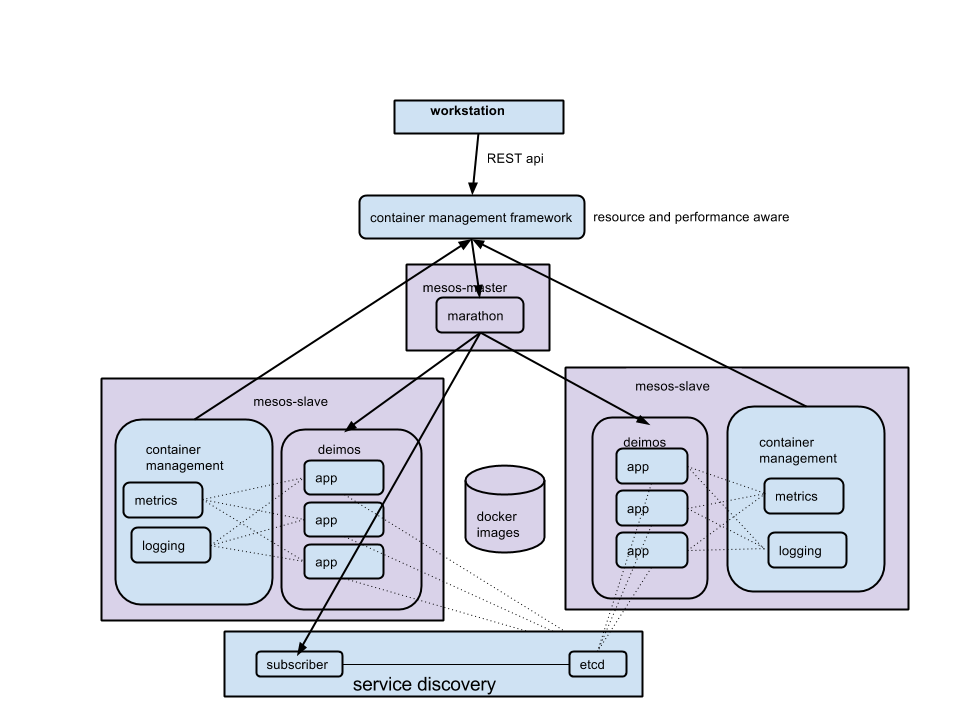

Mesos-Docker-Orchestrator
=========================

container cluster management with mesos and docker. enables users to run their containers on a cluster without having to manage specific machines and ports.
hosts and ports are automatically chosen by the mesos-docker tool, which is resource-aware. tool supports labeling and naming services
to allow easy queries for specific containers. 

the mesos-docker orchestration tool has many pluggable components to allow customizable behavior for each application.
for example there are convenience methods for reading topology and pluggable user-defined methods for responding to changes
in topology. generic methods link rolling upgrades with configurable wait interval also provided.

# Table of contents

- [Overview](#mesos-docker-orchestrator)
- [Table of contents](#table-of-contents)
- [Getting started](#getting-started)
	- [Setting up a mesos cluster](#setting-up-a-mesos-cluster)
	- [Setting up etcd service discovery](#setting-up-etcd-service-discovery)
	- [Launching images](#launching-images)
	- [Guestutils](#guestutils)
	- [Receiving Updates](#receiving-updates)
- [Architecture](#architecture)
	- [Layers](#layers)
	- [Other](#separation-of-concerns)
	- [Alternate design choices](#alternate-design-choices)
- [Demos](#demos)
	- [Sprint 1 Demo (old)](#sprint-1-demo-old)
	- [Sprint 2 Demo](#sprint-2-demo)

# Getting started

### Setting up a mesos cluster
* fabric files included for getting up and running with a mesos cluster
* what it will do:
 * setup and start mesos master with marathon. also run etcd and subscriber on master node for service discovery
 * setup and start slave nodes with modified deimos 
* how to do it:
 * cd into cluster directory
 * place amazon key, secret, path to keypair, and master public ip in fabfile.py
 * launch ec2 instances. name master node "mesos-master" and slave nodes "mesos-slave"
 * __fab master_env master_main__ to install and run mesos, marathon, etcd, subscriber on master
 * __fab slave_env slave_main__ to install and run mesos, deimos on slaves

### Setting up etcd service discovery
Service discovery is implemented with __etcd__ and uses an event __subscriber__ to marathon to maintain status of containers. 
Before launching containers, you must set up an etcd host and a subscriber to marathon so that containers will be registered when mesos starts them.
The subscriber is a lightweight flask app that recieves callbacks from marathon and updates configuration information in etcd.
* __you do not need to do these setups if you used provided fabric files to setup cluster__
* build and push etcd and subscriber images (can be found in docker-images directory)
* run etcd
  * must map a host port to containers exposed port 4001 
  * ex: docker run -p 4001:4001 54.189.193.228:5000/etcd
* run subscriber
  * expects environment variables for CONTAINER_HOST_ADDRESS and CONTAINER_HOST_PORT. These are the public ips of the host and the port that is mapped to container port 5000
  * ex: docker run -t -p 5000:5000 -e CONTAINER_HOST_ADDRESS=54.184.184.23 -e CONTAINER_HOST_PORT=5000 54.189.193.228:5000/subscriber

### Launching images
Interface to mesos cluster is Theseus, a framework build on top of marathon
* see theseus readme for more information
* organizes deployments by service and labels
* manages apps and tasks in marathon and their configuration

### Guestutils

To be registered properly in etcd images __must expose ports__ they need to map to host ports (explicit EXPOSE port1 port2... in Dockerfile)
Images should also __include python-etcd__. An example of this is in docker-images/etcd-base

Images can use the same convenience functions (same method names and signatures) implemented in maestro's guestutils by importing from guestutils.py inside a startup python script
* get_environment_name
* get_service_name
* get_container_name
* get_container_host_address
* get_container_internal_address
* get_port(name, default)
 * returns exposed internal port number of named port
* get_node_list(service, ports = [ port1, port2 ])
 * input: service name and optional list of port names
 * output: list of 'host_ip:port1:port2' ... where host_ip is instance host ip and ports are external ports
* get_specific_port(service, container, port, default)
 * inputs: service, container_name (task_id passed in by marathon), port name
 * optional default value
 * output: exposed port
* get_specific_exposed_port(service, container, port, default)
 * returns exposed port

### Receiving Updates
containers can be set up to recieve updates when certain services are modified. This is implemented through watching keys in etcd.
* how to recieve updates:
 * include watcher.py and watch_methods.py (just like guestutils)
 * set WATCHES=service1,service2,service3 environment variable (comma separated list of services to watch)
 * watcher.py will watch those keys in etcd and run the custom method in watch_methods.py
 * implement watch_methods.py to respond appropriately to changes recieved from etcd

# Architecture

### Layers
* workstation
  * developer provides declarative configuration for applications
  * environment variables, ports, labels, constraints, image name, instances, cpu, mem, etc
* marathon framework (theseus)
  * organizes and manages services deployed (what is deployed where, what ports, what configuration, etc)
  * allow user to see what is deployed, can filter by labels (like cassandra testing)
  * basic container metrics and logs are collected in one place
  * basic scheduling routines: rolling restart service with configurable wait time, constraints for which hosts to deploy onto, etc
* mesos master and marathon
  * recieves apps and tasks from theseus and ensures they remain running
  * publish information to subscriber -> etcd
* mesos-slave machine
  * makes resource offers, recieves tasks from mesos master, executes them
  * basic logging and metrics for containers running on it 
  * should be a "container-optimized machine". it is configured to run containers -> and monitor them and report how they are doing
* deimos and docker
  * run the container
  * containers recieve topology from etcd
  * containers watch etcd for updates

#### separation of concerns

__application configuration:__ interfaces with cluster manager. what and how many to deploy. some constraints like deploy only on large vms and all containers on unique hosts etc

__cluster manager:__ know what is deployed where, can monitor slaves, resources and performance aware (knows what resources are
available and what services/containers are stressed

__slave node:__ know about processes running on itself, monitor cpu memory network etc, logs -> ship to cluster manager

__application:__ only needs to care about itself (what to do with endpoints of other services, 
what to do when endpoints of other services change, how to shut down gracefully (ex when sigterm sent to it etc))

#### Alternate design choices
* who updates configuration in etcd?
 * current: subscriber to marathon
 * process running on slave to check
 * container
* who records metrics
 * current: container
 * process running on slave
* who holds logs/debug information
 * current: container
 * process running on slave
* who holds record of what commands given to management framework (container config etc)?
 * current: container management framework
 * etcd (could have a directory for config and a directory for enpoint info)

# Demos

### Sprint 1 Demo (old)
* mesos master/slaves/marathon already running on ec2 instances
 * mesos: http://54.188.87.91:5050/
 * marathon: http://54.188.87.91:8080/
* etcd already running
* run subscriber on ec2 instance
 * ssh -i helloworld.pem ec2-user@ec2-54-184-184-23.us-west-2.compute.amazonaws.com
 * docker run -t -p 5000:5000 -e CONTAINER_HOST_ADDRESS=54.184.184.23 -e CONTAINER_HOST_PORT=5000 -v /home/ec2-user/docker-data:/opt/data 54.189.193.228:5000/subscriber
 * see container info: http://54.184.184.23:5000/info
* what changes made to images?
 * import a different guestutils file, install python-etcd, explicitly expose ports in Dockerfile
* launch processor (show config.yaml)
 * cassandra, zookeeper
 * kafka
 * processor
 * send curl request to processor 
 * curl -d raw={"hi"} {{ processor_host }}:{{ processor_port }}/ -i
* remove services except cassandra
* run cassandra-tester populate to create 100 records in keyspace
* run cassandra-tester test to read from keyspace
* run updater.py cassandra 3 
 * scale up cassandra to 3 nodes
* modify cassandra-tester to only read from last node ip
 * run cassandra-tester test to show it can read from last node only
* send cleanup signal to previous two nodes
 * observe key repartition
 * ssh in and see:
 * ssh -p 22000 container@{{ host_ip }}
* comparisons between orchestration tools on github

### Sprint 2 demo

__last sprint:__ deploying containers directly through marathon. loose organization of containers (only know about 
apps and tasks in marathon). marathon apps and tasks are not the best descriptors for dockerized applications and services, however.
did not implement etcd watching - scheduling framework would have had to been application specific to sent messages to specific apps to run nodetool cleanup, for example. 
weaker separation of concerns

__this sprint:__ framework on top of marathon to manage marathon apps and tasks. allows flexibility for managing docker containers
specifically. implemented basic scheduling routines in framework. research on separation of concerns (drawing most ideas from kubernetes).
what should framework, master, slave, applications be responsible for.

__demo goals:__
show basic scheduling tasks
show organization benefits of framework
show monitoring, logging features/responsibilities of mesos-docker tool

1. __architecture__
  * diagram - separation of concerns - what is responsible for what
2. already running: cassandra, presenter, watcher, haproxy, ingestor
3. 
