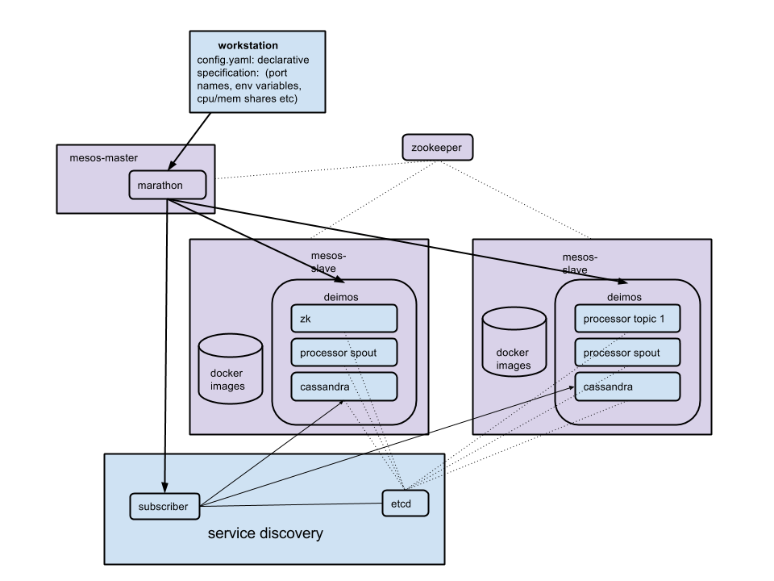

Mesos-Docker-Orchestrator
=========================

mesos-docker orchestration tool

## Setting up a mesos cluster
* fabric files included for getting up and running with a mesos cluster
* what it will do:
 * setup and start mesos master with marathon. also run etcd and subscriber on master node for service discovery
 * setup and start slave nodes with modified deimos 
* how to do it:
 * cd into cluster directory
 * place amazon key, secret, path to keypair, and master public ip in fabfile.py
 * launch ec2 instances. name master node "mesos-master" and slave nodes "mesos-slave"
 * __fab master_env master_main__ to install and run mesos, marathon, etcd, subscriber on master
 * __fab slave_env slave_main__ to install and run mesos, deimos on slaves

## Setting up etcd service discovery
Service discovery is implemented with __etcd__ and uses an event __subscriber__ to marathon to maintain status of containers. 
Before launching containers, you must set up an etcd host and a subscriber to marathon so that containers will be registered when mesos starts them.
The subscriber is a lightweight flask app that recieves callbacks from marathon and updates configuration information in etcd.
* __you do not need to do these setups if you used provided fabric files to setup cluster__
* build and push etcd and subscriber images (can be found in docker-images directory)
* run etcd
  * must map a host port to containers exposed port 4001 
  * ex: docker run -p 4001:4001 54.189.193.228:5000/etcd
* run subscriber
  * expects environment variables for CONTAINER_HOST_ADDRESS and CONTAINER_HOST_PORT. These are the public ips of the host and the port that is mapped to container port 5000
  * ex: docker run -t -p 5000:5000 -e CONTAINER_HOST_ADDRESS=54.184.184.23 -e CONTAINER_HOST_PORT=5000 54.189.193.228:5000/subscriber

## Launching images
Interface to mesos cluster is Theseus, a framework build on top of marathon
* accepts declarative specification about how you want your image deployed
 * image -- name of your image
 * environment -- environment variables
 * ports -- port names and what exposed port they map to (mesos will find avaiable ports on host to map these to)
 * 

## Guestutils

To be registered properly in etcd images __must expose ports__ they need to map to host ports (explicit EXPOSE port1 port2... in Dockerfile)
Images should also __include python-etcd__. An example of this is in docker-images/etcd-base

Images can use the same convenience functions (same method names and signatures) implemented in maestro's guestutils by importing from guestutils.py inside a startup python script
* get_environment_name
* get_service_name
* get_container_name
* get_container_host_address
* get_container_internal_address
* get_port(name, default)
 * returns exposed internal port number of named port
* get_node_list(service, ports = [ port1, port2 ])
 * input: service name and optional list of port names
 * output: list of 'host_ip:port1:port2' ... where host_ip is instance host ip and ports are external ports
* get_specific_port(service, container, port, default)
 * inputs: service, container_name (task_id passed in by marathon), port name
 * optional default value
 * output: exposed port
* get_specific_exposed_port(service, container, port, default)
 * returns exposed port
__recieving updates__

## Updating services
* command line tool updater.py
 * scaling a service: python updater.py cassandra 3 (scale up/down to 3 instances)
 * will not affect already-running containers
* within containers
 * containers can register a callback url to subscriber to recieve updates. for example cassandra containers can receive updates when a node joins the cluster and run nodetool cleanup

## Details

## Sprint 1 Demo
* mesos master/slaves/marathon already running on ec2 instances
 * mesos: http://54.188.87.91:5050/
 * marathon: http://54.188.87.91:8080/
* etcd already running
* run subscriber on ec2 instance
 * ssh -i helloworld.pem ec2-user@ec2-54-184-184-23.us-west-2.compute.amazonaws.com
 * docker run -t -p 5000:5000 -e CONTAINER_HOST_ADDRESS=54.184.184.23 -e CONTAINER_HOST_PORT=5000 -v /home/ec2-user/docker-data:/opt/data 54.189.193.228:5000/subscriber
 * see container info: http://54.184.184.23:5000/info
* what changes made to images?
 * import a different guestutils file, install python-etcd, explicitly expose ports in Dockerfile
* launch processor (show config.yaml)
 * cassandra, zookeeper
 * kafka
 * processor
 * send curl request to processor 
 * curl -d raw={"hi"} {{ processor_host }}:{{ processor_port }}/ -i
* remove services except cassandra
* run cassandra-tester populate to create 100 records in keyspace
* run cassandra-tester test to read from keyspace
* run updater.py cassandra 3 
 * scale up cassandra to 3 nodes
* modify cassandra-tester to only read from last node ip
 * run cassandra-tester test to show it can read from last node only
* send cleanup signal to previous two nodes
 * observe key repartition
 * ssh in and see:
 * ssh -p 22000 container@{{ host_ip }}
* comparisons between orchestration tools on github
