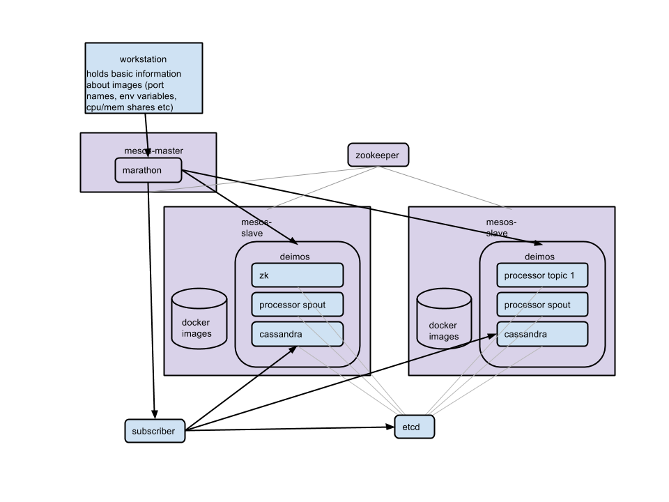

mesos-docker-orchestrator
=========================

mesos-docker orchestration tool

## Setting up a mesos cluster
- on ubuntu 14.04 instance, execute commands listed in master-setup.txt for setting up master
- on ubuntu 14.04 instances, execute commands listed in slave-setup.txt for setting up slave

## Setting up etcd service discovery
Service discovery is implemented with etcd and uses an event subscriber to marathon to maintain status of containers. 
Before launching containers, you must set up an etcd host and a subscriber to marathon so that containers will be registered when mesos starts them.
The subscriber is a lightweight flask app that recieves callbacks from marathon and updates configuration information in etcd.
You can see which containers are up and running by visiting http://{{ subscriber_host }}:{{ subscriber_port }}/info
* build and push etcd and subscriber images (can be found in docker-images directory)
* run etcd
  * must map a host port to containers exposed port 4001 
  * ex: docker run -p 4002:4001 54.189.193.228:5000/etcd
* run subscriber
  * expects a mounted volume from host to container for config file so subscriber can tell what images to register with etcd
  * expects environment variables for CONTAINER_HOST_ADDRESS and CONTAINER_HOST_PORT. These are the public ips of the host and the port that is mapped to container port 5000
  * ex: docker run -t -p 5000:5000 -e CONTAINER_HOST_ADDRESS=54.184.184.23 -e CONTAINER_HOST_PORT=5000 -v /home/ec2-user/docker-data:/opt/data 54.189.193.228:5000/subscriber

## Launching images
Images can be launched using launcher.py (provided in the laucher directory). Before images are launched, image information
must be provided in config.yaml (an example is provided). You must specify etcd and marathon host and port addresses as well as
the names of each of your services and what images they use. There is no need to specify which hosts/ports to put each instance on, as this
will be handled by mesos (except cassandra ports those are hardcoded for now). 
* place configuration information in config.yaml file
  * etcd host and port
  * marathon host and port
  * each service
  * for each service: iamge, ports (these must be explicitly EXPOSE in dockerfile) and should be listed in numberical order). 
  * you can also name port, ports should be listed in format {{ port_name }} : {{ exposed_port }}
  * do not specify which ports they map to, this is handled by mesos
  * cpus and mem (optional) to specify cpu and memory shares
  * instances (optional) to specify how many instances by default to launch (these can be scaled up/down later)
  * environment (option) any additional environment variables to be passed
* use launcher.py to launch containers
  * is a command line tool. launcher.py will make an api call to marathon, and the subscriber will be updated when your instances are running
  * ex: python launcher.py cassandra

## Setting up docker images
Images can use the same convenience functions implemented in maestro's guestutils by importing from guestutils.py inside a startup python script
* get_environment_name
* get_service_name
* get_container_name
* get_container_host_address
* get_container_internal_address
* get_port(name, default)
 * returns exposed internal port number of named port
* get_node_list(service, ports = [ port1, port2 ])
 * input: service name and optional list of port names
 * output: list of 'host_ip:port1:port2' ... where host_ip is instance host ip and ports are external ports
* get_specific_port(service, container, port, default)
 * inputs: service, container_name (task_id passed in by marathon), port name
 * optional default value
 * output: exposed port
* get_specific_exposed_port(service, container, port, default)
 * returns exposed port
To be registered properly in etcd images should expose ports they need to map to host ports (explicit EXPOSE port1 port2... in Dockerfile)

## Updating services
* command line tool updater.py
 * scaling a service: python updater.py cassandra 3 (scale up/down to 3 instances)
* within containers
 * containers can register a callback url to subscriber to recieve updates. for example cassandra containers can receive updates when a node joins the cluster and run nodetool cleanup

## Details

