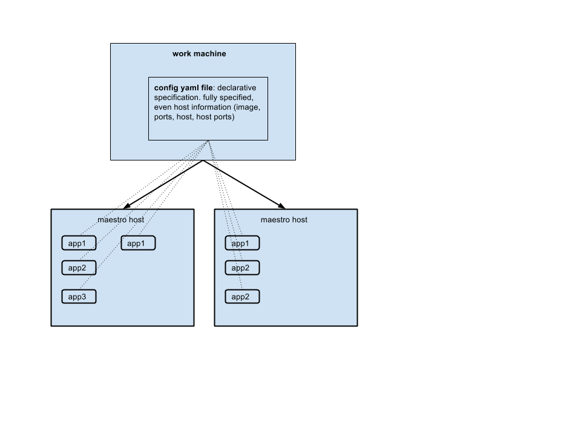
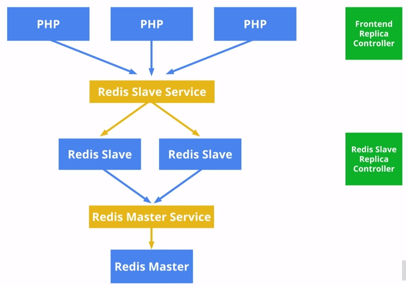
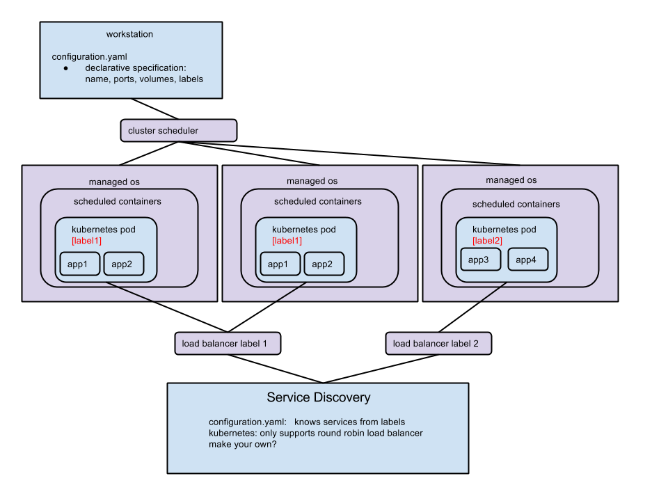

## Centurion

## Maestro
</img>
## Mesos
</img>
## Kubernetes
* type of product: container cluster management
	* sent job descriptions to master node, will spawn containers on work nodes
	* jobs described in "pods" (multiple containers per pod) for example web search frontend, datashard, data loader in one pod
	* labels -> tag pods with labels. (like services in maestro)
* scheduler and workers
	* labels for services -> services live behind load balancer (round robin)
	* service discovery: containers can access other labeled services
	* labels act as selectors (label queries to pick a specific service) service containers live behind load balancer
	* other containers can access service through the load balancer (round robin)
	* ex: getenv('REDISSLAVE_SERVICE_PORT'), getenv('REDISMASTER_SERVICE_PORT'), etc...
	* ex from here: https://github.com/GoogleCloudPlatform/kubernetes/blob/master/examples/guestbook/README.md
	* what about containers talking directly to other containers (not round robin load balancer)? change load balancer. make your own
	* 43:43   https://www.youtube.com/watch?v=tsk0pWf4ipw
	* </img>

</img>

## Other Technologies
* skydock
* fleet
* 
