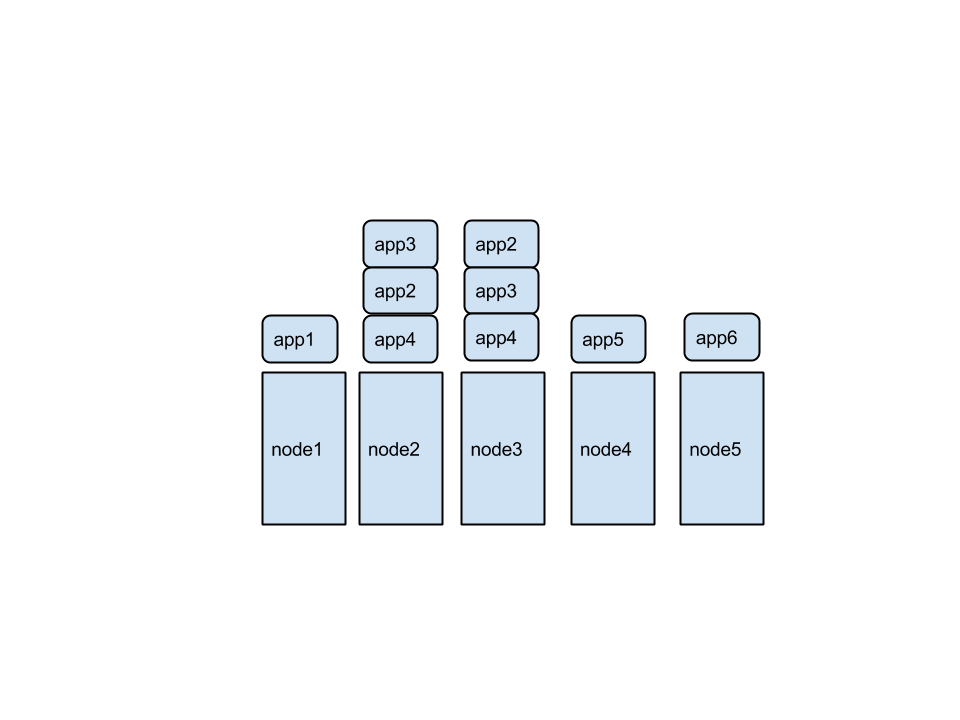
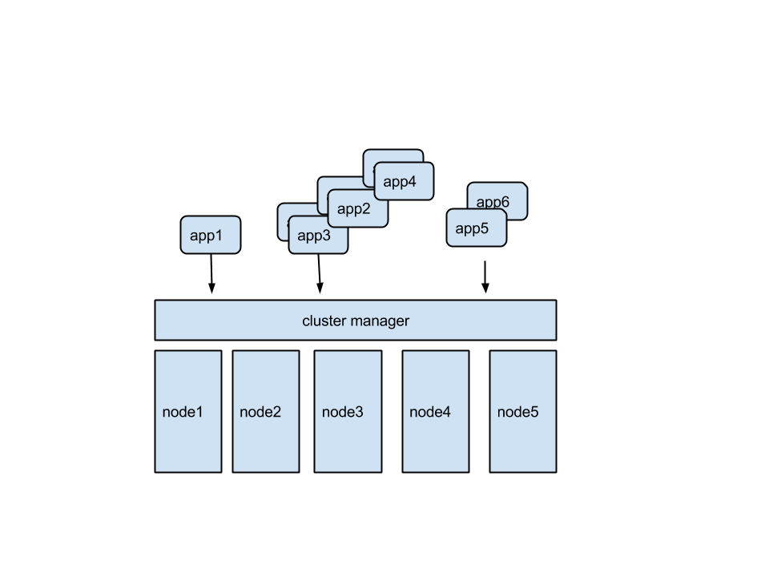
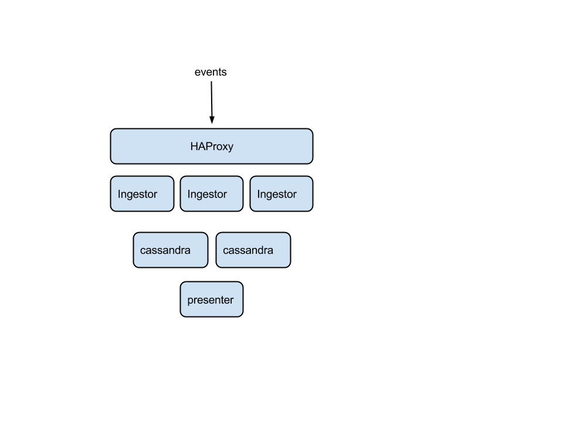

Mesos-Docker-Orchestrator
=========================

mesos-docker orchestration tool

## Background
</img>
</img>

## Architecture

## Demo
* Scheduling Framework components
  * mesos master/slaves/marathon already running on ec2 instances
  * mesos: http://54.188.87.91:5050/
  * marathon: http://54.188.87.91:8080/
* Service discovery components
  * etcd and subscriber already running
* Deploy event service
  * </img>
  * cassandra and presenter already up
  * haproxy - see standard output stream -> watching for ingestors
  * ingestor (haproxy change, make sure up)
  * ingestor.testing (load balanced between both)
  * second haproxy -> labels to select out just. remove second ingestors
  * rolling update all ingestors
  * add cassandra node
  * ssh in and see keys
  * repartition?
